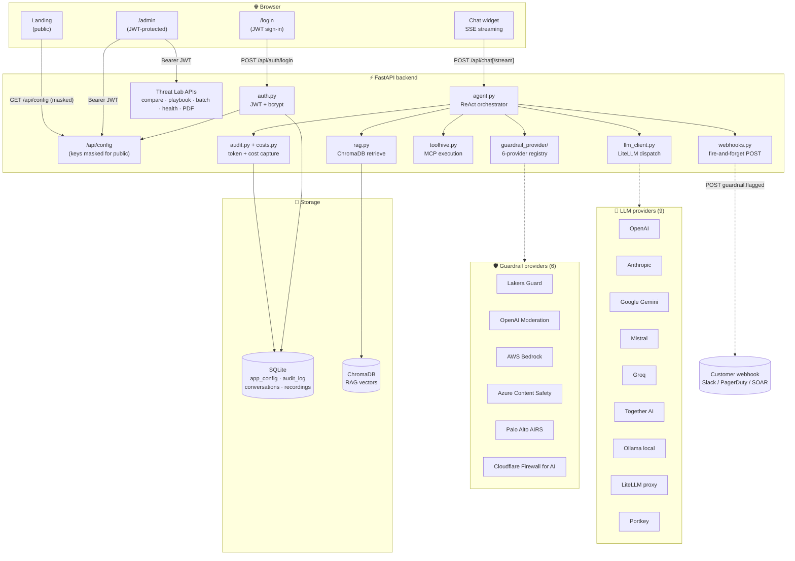
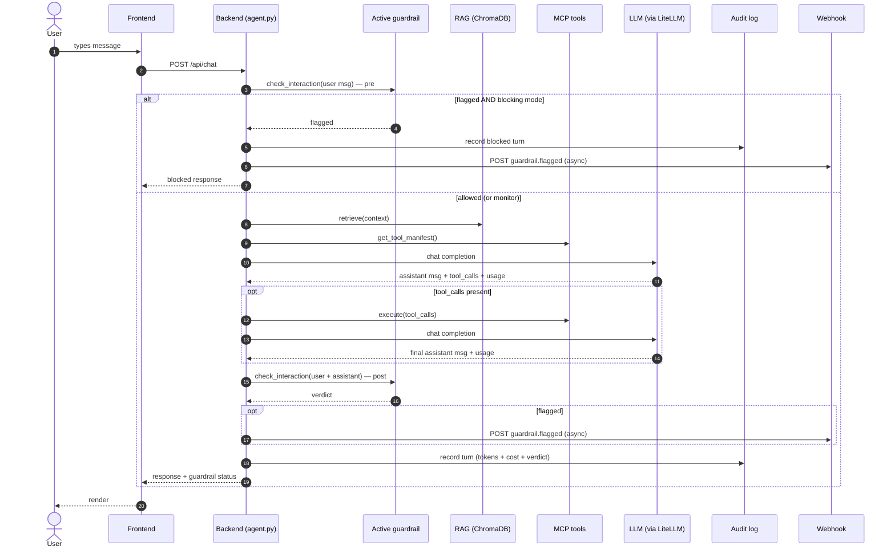
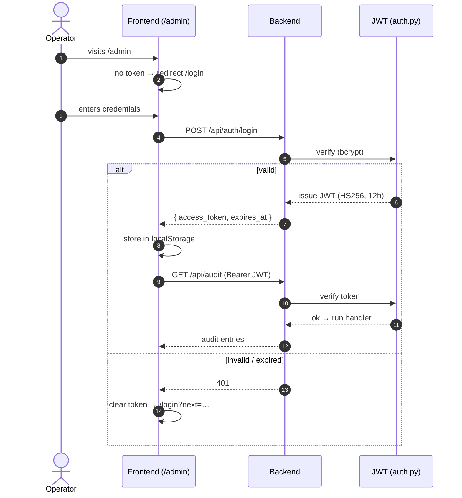

# Agentic Demo - Complete Application

A sophisticated B2B sales demo platform featuring AI-powered chatbot, multi-vendor
LLM + guardrail integration, RAG capabilities, and MCP tools.

## 🚀 Features

### Core platform
- **Skinnable B2B Landing Page** with customizable branding
- **AI Chatbot** with ReAct agent architecture and smart autocomplete
- **Multi-turn conversation memory** (history threaded into every turn)
- **Streaming chat** (SSE) with token-by-token rendering
- **One-click demo scenarios** — 4 fake-company personas (CredFlow, NimbusVault, SafeHarbor, Vitalis) swap branding + system prompt + demo prompts in a single click
- **Bilingual UI** — English / Thai toggle, with **Light / Dark** mode
- **Demo Prompt Corpus** with autocomplete (right-arrow trigger)
- **RAG System** supporting file uploads and AI-generated seed packs
- **MCP Tools** via ToolHive integration
- **Admin Console** with selective ZIP export/import (sections: appearance, LLM, security, RAG, demo prompts, tools)

### Multi-provider integrations
- **12 LLM providers**: OpenAI, Anthropic (Claude), Google (Gemini), Mistral, Groq, Together AI, Ollama (local), self-hosted LiteLLM proxy, OpenRouter, ThaiLLM (national Thai LLM gateway), Kong AI Gateway (self-hosted, OpenAI-compatible), Portkey AI Gateway
- **6 Guardrail providers**: Lakera Guard, OpenAI Moderation, AWS Bedrock Guardrails, Azure AI Content Safety, Palo Alto Prisma AIRS, Cloudflare Firewall for AI
- Per-provider key slots — switching providers does not require re-entering credentials
- Catalog-driven UI — dropdowns auto-populate from `/api/providers` and `/api/guardrail-providers`
- **Dedicated Providers tab** — enable/disable each LLM and guardrail provider, edit keys/base-URL/extra params inline via `EditProviderModal`
- **Demo-safe provider config lock** — read-only toggle that freezes the entire provider config (keys + enable flags) so demo audiences cannot mutate it from the UI

### Playground (Admin tab — single-shot + multi-turn bench)
- Pick any model × any guardrail and hold a conversation against the full agent pipeline (pre-guard → RAG → tools → LLM → post-guard)
- **Image upload + OCR pre-scan** — drop an image, OCR pulls embedded text, the extracted text is fed through the guardrail to catch image-encoded prompt injection (RFP §4.3.14)
- Each assistant turn shows its own verdict (FLAGGED/clean), per-detector breakdown, and any OCR-extracted text inline
- Client-held history — nothing persisted to DB / audit / conversation log; clear or refresh to wipe

### Threat Lab (Admin tab — 9 sub-panels)
- **Audit log** — every chat/guardrail call captured; CSV + PDF export for compliance demos
- **Cost** — per-provider token + spend dashboard (USD/M-token pricing table for 8 providers)
- **Guardrail compare** — fan one prompt to every configured guardrail in parallel, show per-vendor verdict + latency
- **Compare LLMs** — fan one prompt to N LLM providers in parallel (response + tokens + cost + latency)
- **Playbook runner & matrix** — run any playbook (OWASP LLM Top 10 2025, AIGW policy suites, custom) against a chosen guardrail set, or run **M playbooks × N providers** in one shot (concurrency throttled to 5 calls/provider). Each run is persisted with history + side-by-side compare across providers and exportable as CSV
- **Batch eval** — upload CSV of prompts (max 500), get per-prompt verdict matrix
- **Health** — ping every configured LLM + guardrail, return up/down + latency
- **Recordings** — capture a sequence of prompts and replay them through the current agent stack
- **Webhook** — POST to a URL (Slack, PagerDuty, SOAR) on every flagged event; built-in test button
- Plus from the landing page: **Lakera on vs off compare** modal (works for every guardrail provider) and **image moderation** via `POST /api/moderation/image`

### MCP tool controls (Admin → Tools)
- ToolHive integration for MCP connectors (HTTP or local servers)
- **Per-tool allow/deny** — discover each connector's exposed tools, toggle individual tools off without removing the connector (`disabled_tools` list per connector)
- **Per-connector AI Gateway routing** — route a connector's traffic through a named gateway (e.g. Kong key-auth) with a write-only `gateway_api_key` slot that is never echoed back from the API

### Admin authentication
- **JWT-based login** (`POST /api/auth/login`) — 12 h sessions; protect every mutating + sensitive admin endpoint
- **Sign-in screen** at `/login` with default-credentials warning banner
- **`GET /api/config` masks every credential** (`***`) for unauthenticated callers so anonymous visitors can't lift API keys via DevTools
- Env config: `ADMIN_USER`, `ADMIN_PASSWORD`, `JWT_SECRET`, `ADMIN_TOKEN_TTL_HOURS` (fallback `admin`/`admin` + per-process random secret for dev)

## 🏗️ Architecture

- **Frontend**: Vite + React + TypeScript + Tailwind CSS (`dark:` class strategy, EN/TH context, JWT-protected `/admin`)
- **Backend**: FastAPI + SQLite + ChromaDB
- **LLM dispatch**: all 9 providers routed through `litellm.completion()` for a single tool-calling-aware code path
- **Guardrail abstraction**: every provider implements `GuardrailProvider.check_interaction()` and returns the Lakera-shaped status dict so the UI overlay doesn't care which vendor is active
- **Vector DB**: ChromaDB for RAG
- **Auth**: JWT bearer tokens; bcrypt password hashing; env-gated credentials

### System diagram



### Chat request flow



### Auth flow



## 📋 Prerequisites

- Python 3.10–3.12 (3.13+ may break some deps like pandas; use `pyenv` or Homebrew `python@3.12` if needed)
- Node.js 16+
- Docker (required for LiteLLM + Postgres auto-bootstrap)
- **At least one LLM provider key** — OpenAI / Anthropic / Google / Mistral / Groq / Together / Portkey,
  or a self-hosted endpoint (Ollama / LiteLLM proxy)
- **At least one Guardrail provider key (optional)** — Lakera, OpenAI Moderation (free, reuses your OpenAI key),
  AWS Bedrock, Azure AI Content Safety, Palo Alto Prisma AIRS, or Cloudflare Firewall for AI

### Admin auth env vars (recommended for any non-localhost deployment)

```bash
# .env
ADMIN_USER=your-admin-username
ADMIN_PASSWORD=a-strong-password
JWT_SECRET=$(openssl rand -hex 32)       # stable secret across restarts
ADMIN_TOKEN_TTL_HOURS=12                 # optional override (default 12)
```

If `ADMIN_USER` / `ADMIN_PASSWORD` are unset the app falls back to `admin` / `admin`
and prints a warning at startup; the login screen also shows a banner reminding
the operator to set proper credentials before exposing the instance.

## 🛠️ Installation

### 1. Clone and Setup

```bash
git clone <repository-url>
cd guard-demo-client
```

## 🚀 Quick Start (Recommended)

### Fastest Method: Use start_all.py

The easiest way to get started is using the `start_all.py` script, which handles most of the setup for you:

```bash
# 1. First, create and activate a virtual environment
python -m venv venv
source venv/bin/activate  # On Windows: venv\Scripts\activate

# 2. Then run the startup script
python start_all.py
```

**The script will:**
- Install all Python dependencies from `requirements.txt`
- Install all Node.js dependencies from `package.json`
- Auto-start Postgres for LiteLLM (Docker)
- Auto-start LiteLLM proxy container on port 4000 using `litellm/config.yaml`
- Start the backend server on port 8000
- Start the frontend server on port 3000

**Note:** You still need to create and activate the virtual environment first, but the script handles all the dependency installation and service startup for you.

## 🛠️ Manual Setup (Alternative)

If you prefer to set up the components manually or need more control:

### Backend Setup

```bash
# Create virtual environment
python -m venv venv
source venv/bin/activate  # On Windows: venv\Scripts\activate

# Install dependencies
pip install -r requirements.txt

# Start backend server
python start_backend.py
```

### Frontend Setup

```bash
# Install dependencies
npm install

# Start development server
npm run dev
```

### Running Both Services Manually

**Terminal 1 - Backend:**
```bash
python start_backend.py
```

**Terminal 2 - Frontend:**
```bash
npm run dev
```

LiteLLM runs in Docker and is automatically managed by `start_all.py`.

### LiteLLM Setup (Dockerized)

LiteLLM uses `litellm/litellm-database:v1.82.3` (default) and PostgreSQL on `localhost:5432`.

1. Ensure `.env` exists:
   ```bash
   cp .env.example .env
   ```
2. If needed, edit:
   - `litellm/config.yaml` (`general_settings.database_url`, model routes, guardrails)
   - `.env` (`AZURE_API_KEY`, `UI_USERNAME`, `UI_PASSWORD`, optional `LAKERA_*`)
3. Start the stack:
   ```bash
   source venv/bin/activate
   python start_all.py
   ```
4. Open **http://localhost:4000/ui** and sign in with `UI_USERNAME` / `UI_PASSWORD` from `.env`.

**Reuse behavior:** if LiteLLM is already running at `LITELLM_BASE_URL` (default `http://localhost:4000`), startup reuses it and does not launch another LiteLLM container.

Useful scripts:

```bash
./scripts/stop_demo_stack.sh                 # stop backend/frontend and LiteLLM container
./scripts/stop_demo_stack.sh --postgres      # also stop LiteLLM Postgres container
./scripts/fresh_start_demo.sh                # stop + activate venv + start_all.py
```

### Windows Notes

- Use PowerShell activation commands:
  ```powershell
  python -m venv venv
  .\venv\Scripts\Activate.ps1
  python start_all.py
  ```
- In `cmd.exe`, use:
  ```bat
  venv\Scripts\activate.bat
  ```
- Keep Docker Desktop running (Linux containers enabled).
- If LiteLLM image startup fails on your architecture, set `.env`:
  - `LITELLM_DOCKER_PLATFORM=linux/amd64` (current default)
  - or clear it / set `linux/arm64` if your machine supports that image tag.
- If Docker reports a config mount error on Windows path handling, run from PowerShell in the repo root and retry `python start_all.py` (the bootstrap mounts `data/litellm-runtime-config.yaml` into the container).

## 🌐 Access Points

- **Demo Page**: http://localhost:3000
- **Admin Console**: http://localhost:3000/admin
- **Backend API**: http://localhost:8000
- **API Documentation**: http://localhost:8000/docs (if available)
- **LiteLLM Proxy** (optional): http://localhost:4000 — **LiteLLM UI**: http://localhost:4000/ui

## ⚙️ Configuration

### 1. Initial Setup

1. Navigate to http://localhost:3000/admin — you'll be bounced to `/login`
2. Sign in with `ADMIN_USER` / `ADMIN_PASSWORD` from `.env` (or `admin` / `admin` if you haven't set them yet — login screen will warn you)
3. Go to the **Providers** tab — this is the single source of truth for keys, base URLs, and which providers are enabled
   - Enable the LLM provider(s) you want to use and click "Edit" to enter their API key / base URL (slots are kept per provider so you can pre-stage several and switch live)
   - Enable any Guardrail provider(s) and enter their credentials (Lakera, OpenAI Moderation, Bedrock, Azure Content Safety, Palo Alto AIRS, Cloudflare Firewall for AI)
   - Optional: toggle **"Provider config locked"** (demo-safe mode) to make the whole tab read-only for the rest of the demo
4. Go to the **LLM** tab — pick the active model + temperature + system prompt (this tab is settings only; keys live in Providers)
5. Go to the **Security** tab — pick the active guardrail + mode (Block / Monitor) (this tab is behavior only; guardrail keys live in Providers)
6. If using LiteLLM proxy + Lakera guardrails, set guardrail names in Admin → Security to match `litellm/config.yaml`:
   - blocking: `lakera-guard-block`
   - monitor: `lakera-guard-monitor`
7. (Optional) Open the **Threat Lab** tab for the suite: audit log + cost dashboard + guardrail compare + LLM compare + playbook runner + matrix run + run history + batch eval + provider health + recordings + webhook config
8. (Optional) Open the **Playground** tab for an interactive bench — pick a model × guardrail, attach an image (auto-OCR for image-encoded prompt injection), and hold a multi-turn conversation that runs the full agent pipeline without writing to the audit log

### 1b. One-click demo personas

The Landing page has four logo buttons (CredFlow, NimbusVault, SafeHarbor,
Vitalis). Clicking one swaps branding + system prompt + the entire demo prompt
corpus in a single API call — useful when running back-to-back demos for
different verticals.

### 1c. EN/TH and Light/Dark

Top-right of every page: language segmented control (EN/TH) and a sun/moon
button. Both persist via `localStorage` and survive reloads.

### 2. Branding Customization

In the **Branding** tab:
- Set your business name and tagline
- Upload logo and hero images
- Customize hero text

### 3. LLM Configuration

In the **LLM** tab:
- Select OpenAI model (GPT-4o, GPT-4o-mini, etc.)
- Adjust temperature (0-10 scale)
- Customize system prompt

### 4. RAG Setup

In the **RAG** tab:
- Upload documents (PDF, MD, TXT, CSV)
- Generate AI-powered seed packs
- View ingested content

### 5. Tool Management

In the **Tools** tab:
- Add custom tools
- Configure MCP endpoints
- Test tool functionality

### 6. Demo Prompt Corpus

In the **Demo Prompts** tab:
- Create curated demo prompts for different scenarios
- Organize prompts by category (general, security, tools, rag, malicious)
- Set a **preferred LLM** per prompt (chat uses that model when the prompt is selected)
- Add tags for easy searching
- Mark prompts as malicious for security testing
- Track usage statistics

**Chat Autocomplete:**
- Start typing in the chat (minimum 2 characters)
- See real-time suggestions with autocomplete overlay
- Press **right arrow key (→)** to complete the current suggestion
- Click on suggestions in the dropdown to select them
- Escape key to dismiss suggestions

## 🔧 API Endpoints

All API routes are under the `/api` prefix. Endpoints marked **🔒** require a
valid Bearer token from `POST /api/auth/login`.

### Auth
- `GET /api/auth/status` — Public — is admin auth enabled, default-creds warning
- `POST /api/auth/login` — Public — `{ username, password }` → `{ access_token, expires_at, user }`
- `GET /api/auth/me` — 🔒 Current session info
- `POST /api/auth/logout` — 🔒 No-op server side; client drops token

### Config
- `GET /api/config` — Public; **API keys masked** (`***`) unless caller is authenticated
- `PUT /api/config` — 🔒 Update configuration
- `GET /api/config/export` — 🔒 Export config as a **ZIP** (query: `?include=appearance,llm,...&version=2`)
- `POST /api/config/import` — 🔒 Import config from an exported ZIP (merge by section)

### Catalogs (drive the Admin dropdowns)
- `GET /api/providers` — Available LLM providers (9)
- `GET /api/guardrail-providers` — Available guardrail providers (6)
- `GET /api/models` — Models for the active LLM provider (dynamic for proxy/Ollama, else static)

### Chat
- `POST /api/chat` — Public — Send a message; returns response + guardrail status + `conversation_id`
- `POST /api/chat/stream` — Public — Streaming SSE variant (events: `chunk`, `done`, `blocked`, `error`)
- `POST /api/chat/compare` — Public — Run the same prompt with guardrail on **and** off (works for every active guardrail), return both panes
- `POST /api/chat/compare-guardrails` — 🔒 Fan one prompt to every configured guardrail in parallel
- `POST /api/chat/compare-llms` — 🔒 Fan one prompt to N LLM providers in parallel; returns response + tokens + latency + cost per provider

### Conversations (multi-turn memory)
- `GET /api/conversations` — 🔒
- `GET /api/conversations/{id}` — 🔒 Full message history
- `DELETE /api/conversations/{id}` — 🔒

### Audit log
- `GET /api/audit?limit=200&flagged_only=true` — 🔒 JSON entries
- `GET /api/audit?format=csv` — 🔒 CSV export attachment
- `GET /api/audit/cost-summary` — 🔒 Per-provider tokens + estimated USD spend
- `GET /api/audit/report.pdf` — 🔒 Printable PDF summary (reportlab)
- `DELETE /api/audit` — 🔒 Wipe entries (admin / demo-reset only)

### Guardrails
- `GET /api/lakera/last` — Public — Last Lakera result (legacy frontend overlay)
- `POST /api/moderation/image` — 🔒 Scan an image with the active guardrail (`{ image_data_url }`)
- `GET /api/health/providers` — 🔒 Ping every configured LLM + guardrail, return up/down + latency

### Playbooks (security suites)
- `GET /api/playbooks` — Public — Catalog (OWASP LLM Top 10 2025, AIGW policy playbooks, user-defined)
- `GET /api/playbooks/{id}` — Public — Single playbook detail
- `GET /api/playbooks/{id}/export` — Public — Export the playbook's prompts as **CSV**
- `POST /api/playbooks` — 🔒 Create custom playbook
- `PUT /api/playbooks/{id}` — 🔒 Update playbook
- `DELETE /api/playbooks/{id}` — 🔒
- `POST /api/playbooks/{id}/run` — 🔒 Score every prompt through the selected guardrail(s)

### Playbook runs (history + matrix + compare)
- `GET /api/playbook-runs` — 🔒 List past runs (filterable by playbook + provider)
- `POST /api/playbook-runs/multi-provider` — 🔒 Fan one playbook to N providers (concurrency throttled to 5/provider)
- `POST /api/playbook-runs/matrix` — 🔒 **Matrix run** — M playbooks × N providers in one shot
- `GET /api/playbook-runs/compare` — 🔒 Side-by-side compare across providers for a given run set
- `GET /api/playbook-runs/{run_id}` — 🔒 Full per-prompt verdict matrix
- `PATCH /api/playbook-runs/{run_id}` — 🔒 Edit run metadata (title/notes)
- `DELETE /api/playbook-runs/{run_id}` — 🔒

### Playground
- `POST /api/playground/run` — 🔒 Single-turn or multi-turn (client-held history) call through the full agent pipeline with chosen model + guardrail; runs OCR on attached images before guardrail. Does **not** persist to conversations / audit log

### Batch eval
- `POST /api/batch/run` — 🔒 Upload CSV of prompts (column `prompt` or one-per-line, max 500); return verdict matrix

### Recordings (demo replay)
- `GET /api/recordings` — 🔒 List
- `POST /api/recordings` — 🔒 Save `{ name, events }`
- `GET /api/recordings/{id}` — 🔒 Full payload
- `POST /api/recordings/{id}/replay` — 🔒 Re-run every prompt through the current agent
- `DELETE /api/recordings/{id}` — 🔒

### Webhooks
- `POST /api/webhook/test` — 🔒 Fire a `guardrail.test` event to a URL to verify integration; the saved `webhook_url` is fired automatically on every `guardrail.flagged` event

### Scenarios (one-click company switcher)
- `GET /api/scenarios` — Public — List previews
- `POST /api/scenarios/{id}/apply` — 🔒 Apply branding + prompts

### RAG
- `POST /api/rag/upload` — Upload documents
- `POST /api/rag/generate` — Generate AI content
- `GET /api/rag/search` — Search stored content

### Tools
- `GET /api/tools` — Public — List tools (used by chat tool manifest)
- `POST /api/tools` — 🔒 Create tool
- `PUT /api/tools/{id}` — 🔒 Update tool (incl. per-connector AI Gateway routing — `gateway_id`, write-only `gateway_api_key`)
- `DELETE /api/tools/{id}` — 🔒 Delete tool
- `POST /api/tools/test/{id}` — 🔒 Test tool (rediscovers MCP capabilities)
- `GET /api/tools/{id}/capabilities` — Public — List the tools/methods this MCP connector exposes, plus any items currently disabled
- `PATCH /api/tools/{id}/disabled-tools` — 🔒 Update the per-tool allow/deny list on this MCP connector

### Demo Prompts
- `GET /api/demo-prompts` — Public — List demo prompts (chat widget reads this)
- `GET /api/demo-prompts/search` — Public — Search with autocomplete suggestions
- `POST /api/demo-prompts` — 🔒 Create
- `PUT /api/demo-prompts/{id}` — 🔒 Update
- `DELETE /api/demo-prompts/{id}` — 🔒 Delete
- `POST /api/demo-prompts/{id}/use` — Public — Track usage (called from chat widget)

## 📁 Project Structure

```
guard-demo-client/
├── backend/                       # FastAPI backend
│   ├── main.py                    # App factory, inline SQLite migrations, mounts routes/
│   ├── routes/                    # Per-domain route modules
│   │   ├── chat.py                # /api/chat, /chat/stream, /chat/compare-*
│   │   ├── config.py              # /api/config, export/import ZIP
│   │   ├── catalogs.py            # /api/providers, /guardrail-providers, /models
│   │   ├── tools.py               # /api/tools + MCP capabilities + disabled-tools + gateway routing
│   │   ├── playbooks.py           # /api/playbooks CRUD + run + CSV export
│   │   ├── playbook_runs.py       # /api/playbook-runs — history, multi-provider, matrix, compare
│   │   └── threat_lab.py          # /api/batch, /api/health/providers, /api/webhook/test, /api/moderation/image, /api/playground/run
│   ├── models.py                  # SQLAlchemy: AppConfig, Conversation, Message, AuditLog,
│   │                              #   SessionRecording, Tool, RagSource, DemoPrompt, Playbook, PlaybookRun
│   ├── schemas.py                 # Pydantic schemas
│   ├── database.py                # SQLite engine
│   ├── agent.py                   # ReAct agent (pre-guard → OCR → RAG → tools → LLM → post-guard)
│   ├── ocr.py                     # OCR pre-scan for image-embedded prompt injection (pytesseract → vision-LLM fallback)
│   ├── llm_client.py              # LiteLLM dispatch for all 12 providers + SSE streaming
│   ├── providers.py               # LLM provider catalog (OpenAI/Anthropic/.../ThaiLLM/Kong/Portkey)
│   ├── auth.py                    # JWT login + require_admin dependency
│   ├── costs.py                   # Per-provider pricing table + cost estimator
│   ├── webhooks.py                # Outbound webhook on guardrail.flagged events
│   ├── audit.py                   # Audit log writer + CSV + token/cost capture
│   ├── playbooks.py               # Built-in suites (OWASP LLM Top 10 2025, AIGW policy)
│   ├── scenarios.py               # 4 one-click demo company personas
│   ├── rag.py                     # RAG service, ChromaDB
│   ├── lakera.py                  # Legacy Lakera REST client + UI state
│   ├── toolhive.py                # MCP tool execution + per-connector AI Gateway routing
│   └── guardrail_provider/        # Unified guardrail abstraction
│       ├── base.py                # GuardrailProvider ABC + Lakera-shaped status
│       ├── registry.py            # Catalog + active resolver + UI metadata
│       ├── lakera_provider.py
│       ├── openai_moderation_provider.py
│       ├── bedrock_provider.py    # AWS Bedrock Guardrails (ApplyGuardrail)
│       ├── azure_content_safety_provider.py  # text:analyze + text:shieldPrompt + image:analyze
│       ├── palo_alto_provider.py  # Prisma AIRS /v1/scan/sync/request
│       └── cloudflare_provider.py # Workers AI Llama Guard 3 (S1–S14 taxonomy)
├── src/                            # React frontend
│   ├── components/
│   │   ├── ChatWidget.tsx          # Chat + image upload + multimodal + stream toggle + conversation_id threading
│   │   ├── ThreatLab.tsx           # Admin tab: panels for audit/cost/compare/playbook matrix/run history/.../webhook
│   │   ├── Playground.tsx          # Admin tab: interactive multi-turn bench (client-held history, runs full agent pipeline)
│   │   ├── PlaybookManager.tsx     # Playbook CRUD + CSV export
│   │   ├── ToolManager.tsx         # MCP connectors + per-tool allow/deny + gateway routing
│   │   ├── EditProviderModal.tsx   # Inline per-provider key/base-URL editor (Providers tab)
│   │   ├── CompareDialog.tsx       # Active-guardrail-on vs off side-by-side
│   │   ├── ScenarioSwitcher.tsx    # One-click company logo bar
│   │   ├── UIToggles.tsx           # EN/TH + Light/Dark switches
│   │   ├── LakeraOverlay.tsx       # Per-detector verdict panel
│   │   ├── DemoPromptManager.tsx
│   │   └── RagManagement.tsx
│   ├── auth/
│   │   ├── AuthContext.tsx         # JWT token storage + login/logout helpers
│   │   └── ProtectedRoute.tsx      # Wraps /admin; redirects to /login when no token
│   ├── pages/                      # AdminConsole (12 tabs incl. Providers + Playground), LandingPage, Login
│   ├── services/api.ts             # Typed REST + SSE iterator + auto Bearer header
│   ├── i18n/                       # EN/TH dictionaries + UIContext + guardrailLabel
│   └── types/
├── data/                           # gitignored: SQLite DB + ChromaDB vectors
├── designdocs/                     # In-repo design notes (incl. MULTI_WORKSPACE_DESIGN.md for Phase 2)
├── fakecompanies/                  # Bundled logos + hero images + sample exports for scenarios
├── litellm/                        # LiteLLM proxy Dockerised config
├── scripts/                        # stop_demo_stack.sh, fresh_start_demo.sh, seed_aigw_policy_playbooks.py
├── tests/                          # pytest suite (providers, playbook_runs, provider_config_lock, ...)
├── e2e/                            # Playwright smoke tests
├── requirements.txt
├── package.json
├── start_all.py                    # Start backend + frontend + LiteLLM (recommended)
├── start_backend.py                # Backend-only
└── README.md
```

## 🎯 Demo Features

### Chat Interface
- Real-time chat with AI assistant
- **Streaming mode** (SSE) — token-by-token rendering, toggle below the input
- **Multi-turn memory** — `conversation_id` threaded automatically; "New chat" button to reset
- Smart autocomplete with demo prompt corpus
- Tool usage tracking
- Guardrail status overlay (works for every guardrail provider)
- Message history

### Guardrail Integration
- Six interchangeable providers — switch from the Admin → Security dropdown
- Blocking vs Monitor mode applies to all providers
- LiteLLM-native Lakera guardrails when LiteLLM proxy is active
- Unified Lakera-shaped result dict so the UI overlay is provider-agnostic
- Per-detector breakdown with TL;DR summaries

### Threat Lab (Admin)
- **Audit log** — full history, CSV export, "Flagged only" filter
- **Compare matrix** — fan a single prompt to every configured guardrail in parallel
- **OWASP playbook runner** — score Top-10-for-LLMs against your active vendor
- **Recordings** — save and replay prompt sequences through the current agent

### Compare on the Landing page
- Lakera-on vs Lakera-off side-by-side modal (`POST /api/chat/compare`)

### RAG Capabilities
- Document upload (PDF, MD, TXT, CSV)
- AI-generated content creation
- Semantic search
- Content chunking and embedding

### Tool Integration
- Calculator tool
- HTTP fetch tool
- Calendar lookup
- GitHub repository info
- Custom tool addition

### Demo Prompt Corpus
- Curated prompt library for consistent demos
- Category-based organization (general, security, tools, rag, malicious)
- Tag-based search and filtering
- Usage tracking and analytics
- Smart autocomplete in chat interface
- Right arrow key (→) completion trigger
- Visual indicators for malicious prompts
- Admin interface for prompt management

## 🔒 Security Features

- **JWT admin auth** with login screen — protects every mutating + sensitive endpoint
- **API key masking on public reads** — `GET /api/config` returns `"***"` for every credential field unless the caller presents a valid Bearer token
- **bcrypt password hashing** + per-process JWT secret fallback (override via `JWT_SECRET` env)
- **Audit log + webhook** — every flagged guardrail event captured and optionally POSTed to a customer-configured URL (Slack / PagerDuty / SOAR)
- Content moderation via any of 6 guardrail providers (Lakera / OpenAI Moderation / Bedrock / Azure / Palo Alto AIRS / Cloudflare Firewall for AI)
- Secure file upload validation
- Input sanitization
- CORS configuration

## 📦 Export/Import

Configuration is exported and imported as **ZIP files** (not JSON). You choose which sections to include.

### Export

1. Go to **Admin Console → Export/Import**.
2. Check the sections you want in the export:
   - **Appearance**, **LLM**, **Security**, **RAG scanning**, **Demo prompts**, **Tools**, **RAG** (default: all checked).
   - **API keys** and **Project IDs** are off by default (safe for sharing).
3. Click **Export**. A ZIP file is downloaded (e.g. `agentic_demo_config_2026-02-23T12-00-00.zip`).

The ZIP contains `metadata.json` (version 2.0, list of included sections), `config.json`, and section-specific files such as `demo_prompts.json`, `tools.json`, `rag_sources.json`, and the ChromaDB vector store when those sections are included.

### Import

1. Go to **Admin Console → Export/Import**.
2. Upload a previously exported **ZIP** file.
3. The app **merges by section**: only sections present in the ZIP are applied (e.g. a “safe” export does not overwrite your API keys or project IDs).
4. After import, a summary shows which sections were applied. RAG (ChromaDB) is loaded from the ZIP without replacing the live `data/chroma` directory in use; the app switches to the imported vectors so RAG keeps working.

**Tips:**

- For **demo prompts** to be in the export, include the **Demo prompts** section when exporting. Re-export after adding prompts if your current ZIP was created before that change.
- **v1.0** ZIPs (no `metadata.json` version 2.0 or old format) are still supported: full replace behavior, and demo prompts can be read from `demo_prompts.json` or from `data/agentic_demo.db` inside the ZIP.

## 📝 Changelog

See [CHANGELOG.md](CHANGELOG.md) for recent changes (LiteLLM integration, model selection).

## 🐛 Troubleshooting

### Common Issues

1. **Backend won't start**
   - Check Python version (3.10–3.12)
   - Verify all dependencies installed (`pip install -r requirements.txt`)
   - Check port 8000 availability

2. **Frontend won't start**
   - Check Node.js version (16+)
   - Run `npm install`
   - Check port 3000 availability

3. **API errors**
   - Verify OpenAI API key is set
   - Check network connectivity
   - Review browser console for CORS issues

4. **Database issues**
   - Delete `data/` folder to reset
   - Check file permissions
   - Verify SQLite installation

### Logs

- Backend logs: Check terminal running `start_backend.py`
- Frontend logs: Check browser console
- LiteLLM container logs: `docker logs -f guard-demo-litellm-proxy`
- API logs: Check backend terminal output

## 🤝 Contributing

1. Fork the repository
2. Create a feature branch
3. Make your changes
4. Test thoroughly
5. Submit a pull request

## 📄 License

This project is licensed under the MIT License.

## 🆘 Support

For issues and questions:
1. Check the troubleshooting section
2. Check the browser console for errors
3. Review backend logs in the terminal
4. Check the API endpoints in the code if needed

---

**Happy Demo-ing! 🎉**
