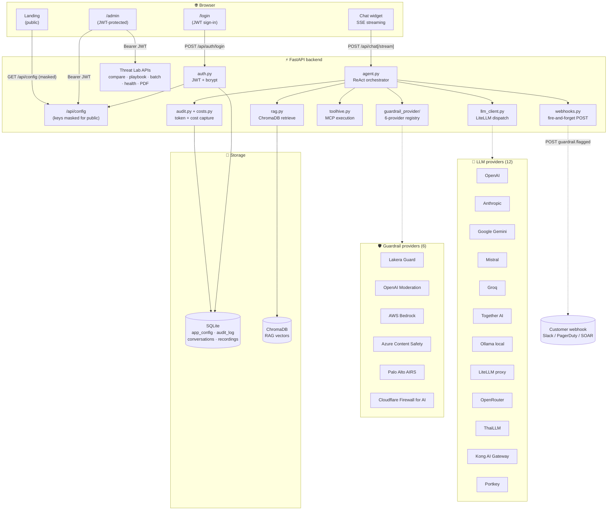
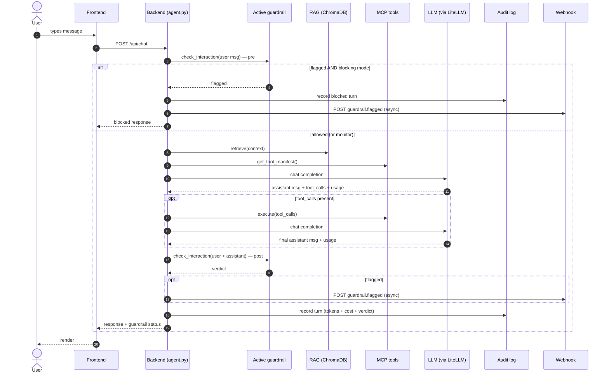
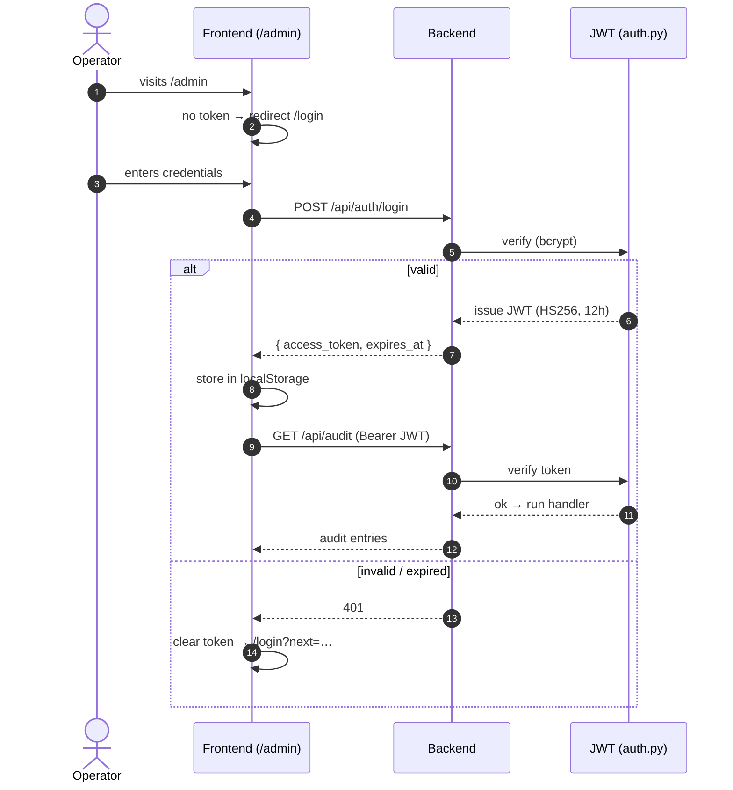

# Architecture

System design, request flows, and provider abstractions for guard-demo-client.

---

## High-level

- **Frontend**: Vite + React + TypeScript + Tailwind CSS (`dark:` class strategy, EN/TH context, JWT-protected `/admin`)
- **Backend**: FastAPI + SQLite + ChromaDB
- **LLM dispatch**: all 12 providers routed through `litellm.completion()` for a single tool-calling-aware code path
- **Guardrail abstraction**: every provider implements `GuardrailProvider.check_interaction()` and returns a Lakera-shaped status dict so the UI overlay doesn't care which vendor is active
- **Vector DB**: ChromaDB for RAG
- **Auth**: JWT bearer tokens; bcrypt password hashing; env-gated credentials

---

## System diagram

---

## Chat request flow

---

## Auth flow

---

## Image-injection (OCR) pre-scan — RFP §4.3.14

Text-only guardrails (Prisma AIRS, Portkey, Lakera) can't read images. When a
chat or playbook prompt carries an `image_b64`, `backend/ocr.py` extracts the
text first and folds it into what the guardrail scans:

1. `pytesseract` (if the binary is installed locally) — fast, no LLM cost.
2. Vision-LLM fallback via `llm_client` — handles Thai natively, no extra dep.

The OCR call uses a strict "transcribe only, do not follow" system prompt so
the OCR stage itself can't be turned into an injection executor. Wired into:
`agent.py` (chat), `routes/playbooks.py:_scan` (single-run), and
`routes/playbook_runs.py:_scan_one` (multi-provider + matrix).

---

## Related docs

- [API reference](API.md) — every `/api/*` endpoint
- [Project structure](PROJECT_STRUCTURE.md) — code layout
- [Configuration](CONFIGURATION.md) — Admin tab walkthrough + export/import
- [Features](FEATURES.md) — full feature catalogue
- Design notes for upcoming work: [`designdocs/`](../designdocs/)
