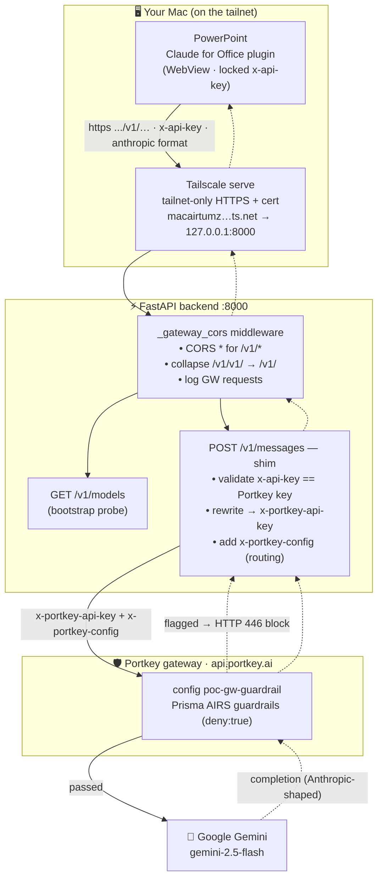
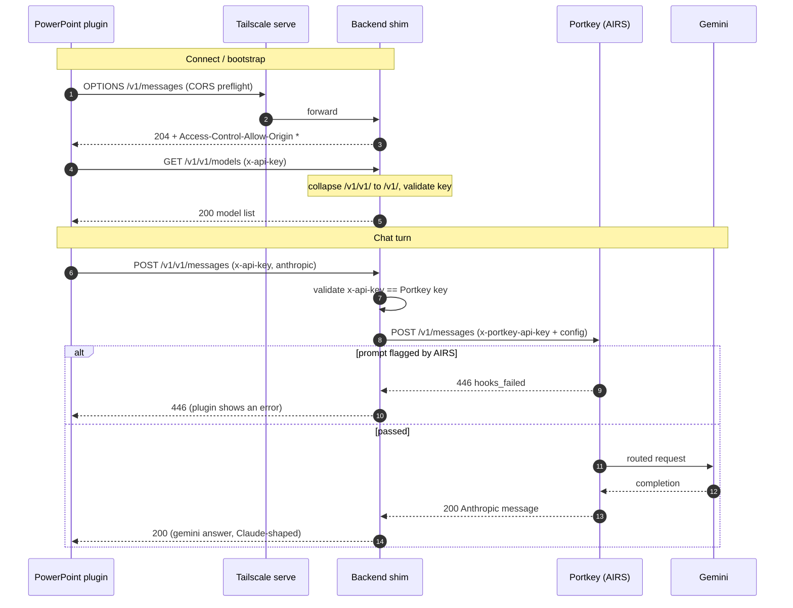

# Claude for Office (PowerPoint) → Portkey gateway shim

Anthropic-native clients like **Claude for Office** send their gateway auth in
the `x-api-key` header and don't let you change it. **Portkey only accepts its
key via `x-portkey-api-key`** (or `Authorization: Bearer`), so pointing the
plugin straight at `https://api.portkey.ai/v1` fails:

```
Claude for Office connection failed (Gateway)
Invalid authentication token
  url: https://api.portkey.ai/v1
  authHeader: x-api-key
HTTP 401 {"message":"Portkey Error: Invalid API Key. Error Code: 03"}
```

This backend ships a small **Anthropic-format shim** that bridges the two.

## How it works

### Traffic flow



### Request lifecycle



- Endpoint: `POST /v1/messages` (`backend/routes/anthropic_proxy.py`).
- Auth: the incoming `x-api-key` must equal the configured `portkey_api_key`
  (constant-time compare). It is **not an open relay** — the caller must
  already hold the Portkey key.
- Routing: forwards with the active `portkey_config` (or `portkey_virtual_key`)
  — the same routing the chat path uses. Today that resolves to
  `gemini-2.5-flash` (the account has no Anthropic provider).
- Streaming: both non-streaming JSON and SSE streaming are proxied unchanged.

## Setup (you change ONE thing in the plugin)

1. **Expose this backend over HTTPS.** The plugin runs in a WebView on the
   user's Mac (it sends a CORS preflight from `*.officeapps.live.com`), so the
   request originates locally — a **tailnet-only HTTPS serve is enough**, no
   public exposure needed. Plain `http://localhost` does NOT work (the HTTPS
   WebView blocks it as mixed content, and there's no cert).
   ```
   tailscale up                 # if it's stopped
   tailscale serve --bg 8000    # tailnet-only HTTPS + cert (recommended)
   # tailscale funnel --bg 8000 # only if the client turns out to call from the cloud (public)
   ```
2. **In Claude for Office → connection settings, change only the gateway URL:**

   | Field | Before | After |
   |---|---|---|
   | gateway URL | `https://api.portkey.ai/v1` | `https://<your-tailnet-host>/v1` |
   | token (`x-api-key`) | *(Portkey key)* | **unchanged** |
   | apiFormat | `anthropic` | **unchanged** |

   The plugin will call `https://<your-tailnet-host>/v1/messages` with the same
   `x-api-key`; the shim accepts it and forwards to Portkey. A base URL that
   already ends in `/v1` is fine — the middleware collapses the resulting
   `/v1/v1/...` back to `/v1/...`.

## Security notes

- The relay forwards using the **server's** Portkey key, gated by the
  `x-api-key` match. Because exposing this backend publicly also exposes the
  Admin Console, set real `ADMIN_USER` / `ADMIN_PASSWORD` / `JWT_SECRET` before
  opening a tunnel — don't leave the `admin` / `admin` dev fallback.
- Disable the shim without removing the route by setting
  `CLAUDE_OFFICE_PROXY_ENABLED=0` (then `/v1/messages` returns 404).

## Want real Claude instead of gemini?

The Portkey account currently has no Anthropic provider, so requests resolve to
gemini wearing Anthropic response format. To serve real Claude, add an
**Anthropic integration** in Portkey (needs an Anthropic API key) and point the
active `portkey_config` / `portkey_virtual_key` at it — no code change needed;
the shim forwards whatever routing is configured.
