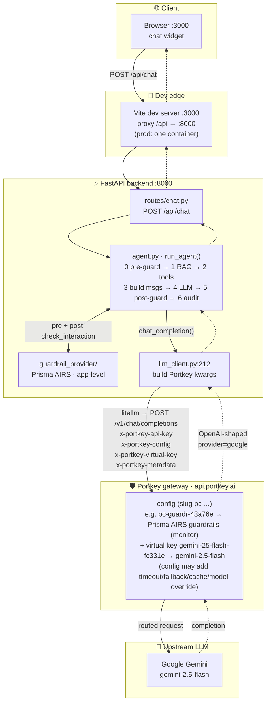
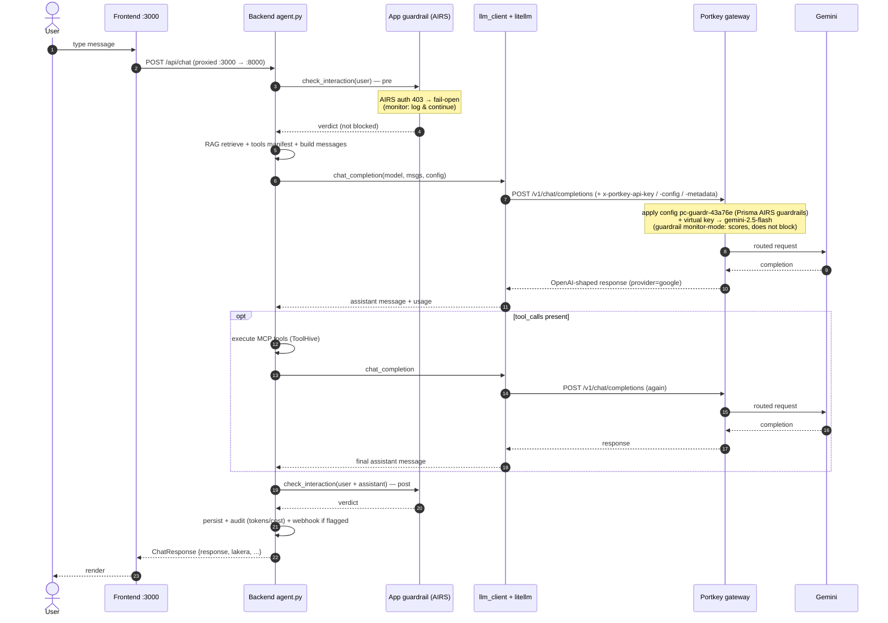
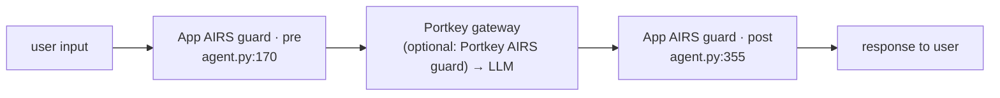

# Traffic flow (Portkey gateway egress)

How a chat request travels end-to-end when the active LLM provider is
**Portkey**. This complements the generic
[Chat request flow](ARCHITECTURE.md#chat-request-flow) in `ARCHITECTURE.md`
by showing the parts that diagram abstracts away: the Portkey gateway hop, the
headers `llm_client` injects, the config-driven model override, and the two
independent guardrail layers.

> Reflects the live integration: `llm_provider=portkey`,
> `portkey_config=pc-guardr-43a76e` (Prisma AIRS guardrails, **monitor mode** —
> `deny:false`) **+** `portkey_virtual_key=gemini-25-flash-fc331e` →
> `gemini-2.5-flash`. A guardrail-only config has no model target, so it needs a
> virtual key alongside it. Use the config **slug** (`pc-...`), not its display
> name. Swap the config / virtual key and only the **Portkey gateway** box
> changes — the rest of the path is identical.

---

## End-to-end path

---

## Request lifecycle (sequence)

---

## Two guardrail layers (independent)

Portkey is purely the **LLM egress** layer — it slots in at step 4
(`llm_client.py:212`). Guardrails can run in two separate places:

- **App-level** (Prisma AIRS) — runs inside `run_agent` around the whole prompt
  (pre at `agent.py:170`, post at `agent.py:355`). Gated by the `lakera_enabled`
  master toggle. *Currently the AIRS key auth-fails (403) and fails open — it
  logs but does not block.*
- **Portkey-level** (optional) — if the active config declares
  `input_guardrails` / `output_guardrails` (e.g. `pc-guardr-43a76e` →
  `pg-prisma-c06001`), the guardrail runs **inside the gateway**, wrapping the
  LLM call, with no AIRS key needed in the app.

---

## Notes

- **Config override**: with a config that sets `override_params.model`, the
  body `model` the app sends (`openai_model`) is replaced by the gateway — so
  sending `gpt-4o` still served `gemini-2.5-flash` in testing. The app-side
  `openai_model` is cosmetic on the config path.
- **No UA workaround needed**: litellm's `OpenAI/Python` User-Agent passes
  Portkey's Cloudflare; only the bare `Python-urllib` UA gets a 1010 block
  (unlike the ThaiLLM branch, which does override the UA — `llm_client.py:182`).
- **Header construction**: `x-portkey-config` / `x-portkey-metadata` are built
  by `_portkey_header_value()` (`llm_client.py`), which compacts inline JSON so
  it is header-safe; a bare `pc-...` slug passes through.

## Related docs

- [Architecture](ARCHITECTURE.md) — system diagram, generic chat flow, auth flow
- [Configuration](CONFIGURATION.md) — Admin tab walkthrough (Providers → Portkey)
- [API reference](API.md) — `/api/chat` and `/api/config`
